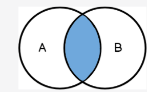
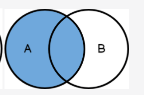
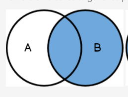
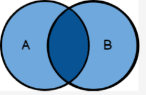

# Primeira parte

## O que é chamado de JOIN em um banco de dados?

A operação join é usada para relacionar duas tabelas, assim conseguindo obter um resultando contendo
informações de várias tabelas.

## Nomeie e explique 2 tipos de JOIN.

* Left Join: Retorna todas as linhas da tabela da esquerda, podendo ou não conter uma linha
  relacionada no lado direito.

* Inner Join: Pega todas as linhas da esquerda que possuem alguma relação com a tabela da direita

## Para que é usado o GROUP BY?

Quando é necessário agrupar dados por alguma propriedade, usado em conjunto com funções de
agregação. Exemplo, pegar a contagem de filmes por ano.

## Para que é usado o HAVING?

É usado quando precisamos filtrar os resultados baseando-se em uma agregação.

## Dados os diagramas a seguir, indique a qual tipo de JOIN cada um corresponde:

*  - Inner
*  - Left

## Escreva uma consulta genérica para cada um dos diagramas abaixo:

### Right join


```mysql
select m.title, m.rating
from genres
         right join movies m on genres.id = m.genre_id
where genres.id = 3
```
### Full join

> Utilizando sintaxe do Postgres para este exemplo, pois o MySql não oferece esta sintaxe
```postgresql
  select *
  from studios
         full join movies m
          on studios.id = m.studio_id
```
---
# Segunda parte
Utilizado o banco MySQL, este dump não está mais na plataforma, pois foi substituído pelo Postgres.
Para ter acesso ao banco original, basta utilizar o arquivo [./movies-db.sql](./movies-db.sql)

## 1. Mostre o título e o nome do gênero de todas as séries.

```mysql
SELECT s.title as title, g.name as genre
from series s
         left join genres g on g.id = s.genre_id;
```

## 2. Mostre o título dos episódios, o nome e o sobrenome dos atores que atuam em cada um deles.

```mysql
select series.title                                     as series_title,
       episodes.title                                   as episode_title,
       concat(actors.first_name, ' ', actors.last_name) as actor_name
from episodes
         left join seasons on seasons.id = episodes.season_id
         left join series on seasons.serie_id = series.id
         left join actor_episode ae on episodes.id = ae.episode_id
         left join actors on ae.actor_id = actors.id
order by series.title, episodes.release_date;
```

## 3. Mostre o título de todas as séries e o número total de temporadas que cada uma delas possui.

```mysql
select series.title as title, count(*) as seasons
from series
         left join seasons on series.id = seasons.serie_id
group by series.id;
```

## 4. Mostre o nome de todos os gêneros e o número total de filmes de cada um, desde que seja maior ou igual a 3.

```mysql
select g.name as genre_name, count(*) as movie_count
from movies
         left join genres g on movies.genre_id = g.id
group by g.id
having movie_count >= 3
order by movie_count desc;
```

## 5. Mostre apenas o nome e o sobrenome dos atores que atuam em todos os filmes de Star Wars e que estes não se repitam.

```mysql
select concat(actors.first_name, ' ', actors.last_name) as name, sum(1) as movies
from actors
         inner join actor_movie on actors.id = actor_movie.actor_id
         inner join movies m on actor_movie.movie_id = m.id
where m.title like '%La Guerra de las galaxias%'
group by actors.id

```

